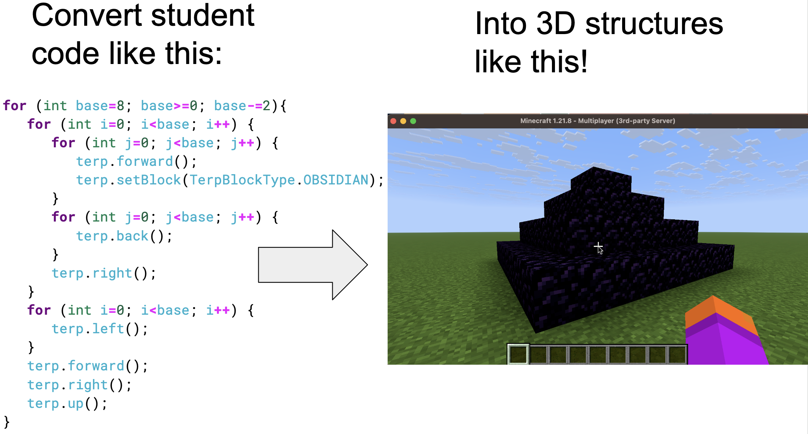

# Knoxcraft Terps: 3D Logo with Turtles



🛠️ This mod is built using [Minecraft Forge](http://minecraftforge.net/) 🛠️

## Students (Java)

* Download the [latest Java knoxcraft-client.zip release](https://github.com/jspacco/knoxcraftmod/releases/latest/)
* Unzip and open in VS Code
    - double-click the `DoubleClickToOpen.code-workspace` file!
    - ❌ File => Open folder will NOT work correctly
* Install vanilla Minecraft 1.21.8
* Choose Multiplayer
* Enter the server URL provided by your instructor
* Log into Knoxcraft!

### Configure Knoxcraft Terps programs:

Each Knoxcraft Terps program, such as [Mauritius.java](https://raw.githubusercontent.com/jspacco/knoxcraftmod/refs/heads/mc/1.21.8-vanilla/src/main/java/edu/knox/knoxcraftmod/client/example/Mauritius.java), begins with a series of variable declarations. Check the comments below to see how to enter the proper values in your program.

```java
// Your instructor gives you this URL
String serverUrl = "http://euclid.knox.edu:8080";
// Your Minecraft playername
// You need to buy Minecraft
// This fulfills Spacdog's years-long dream:
// telling students they need to buy Minecraft for school
String minecraftPlayername = "spacdog";
// Your instructor gives you username/password
// This is just so that if you write something offensive with
// Minecraft blocks, we will know who did it.
// Instructors may not use username/password,
// if that's the case just leave it as the empty string
String username = "test";
// THIS IS NOT YOUR COLLEGE EMAIL PASSWORD
// It's an insecure password that only works with Knoxcraft Terps
String password = "foobar123";
// Pick a name for your program
// NO SPACES in the programName
// "house" and "drawhouse" are good; "draw house" won't work
String programName = "house";
// Whatever description you want
String description = "Build a primitive hovel made of dirt, grass, and random blocks: the classic first Minecraft house";
```

## Knoxcraft Terps commands

You can run the following slash commands in Knoxcraft Terps:

`/terp list [ <minecraftPlayername> ]` <font style="color: blue;"># list your Terp programs. If supplied a Minecraft playername, lists the programs for that player </font>

`/terp summon` <font style="color: blue;"># summon your Terp to your current position</font>

`/terp forward|back|up|down|left|right|turnleft|turnright` <font style="color: blue;"># move or turn your terp — useful for adjust the start position of your program</font> 

`/terp run <program_name> [ <minecraftPlayername> ]` <font style="color: blue;"># run the program with program_name. If supplied a Minecraft playername, will run  program_name from that player's list of programs. Useful for  </font> 


## Instructors

You will need to run a Minecraft server for your students. This is **not** as difficult as you are currently thinking it will be.

### Requirements
* A linux server visible to your students where you can run a Minecraft server
    - Talk to your IT staff
    - Yes it's possible to run a server in the cloud, but it's not trivial
* Java 21 
    — ❌ other Java versions will **NOT** work!
* Download Forge [1.21.8-58.0.6](https://maven.minecraftforge.net/net/minecraftforge/forge/1.21.8-58.0.10/forge-1.21.8-58.0.10-installer.jar)
* Download the [latest release of knoxcraftmod-vX.Y.Z.jar](https://github.com/jspacco/knoxcraftmod/releases)
* Download the [install-server.sh](https://raw.githubusercontent.com/jspacco/knoxcraftmod/refs/heads/mc/1.21.8-vanilla/tools/install-server.sh) script

### How to install

1. Create the following directory structure (or something like it)

```
└── 📁Knoxcraft/
    ├── 📁server/
    ├── forge-1.21.8-58.0.6-installer.jar
    ├── install-server.sh
    └── knoxcraftmod-0.0.1.jar
```

If the `server` folder does not exist, the script will create it.

2. Now `cd` into the `Knoxcraft` folder and run this command:

`./install-server.sh forge-1.21.8-58.0.6-installer.jar knoxcraftmod-0.0.1.jar server`

This will install and start up a new Minecraft server modded with Knoxcraftmod in the `server` folder. It accepts [Minecraft's End User License Agreement (EULA)](https://www.minecraft.net/en-us/eula); please make sure you are OK with this. gthe install script also starts the server.

3. You can stop the server with the `/stop` slash commmand. 

4. To restart the server, go into the `Knoxcraft/server` folder and run:

`./run.sh nogui`

5. On Linux, you probably want to start the server with `screen` so it keeps running after you close your terminal, but you can later reattach to the process.

`screen -S myserver` (or whatever you want to name the session running your server)

Then start your Knoxcraft Terps server

`./run.sh nogui`

Now you can detach from your running server with `Cntr-a d` (`control` and `a` together followed by `d`), and if you log out of your shell, the server will remain running.

To reattach to your server process:

`screen -r` or if you have multiple sessions `screen -r myserver` (or whatever you named the session running your server)

## FAQ

**Q: What if I want to use this in one of my classes?**
> A: Try installing it, and when something inevitably doesn't work, email me (jspacco at knox dot edu) and I will try to help you.

**Q: What actually gets uploaded to the server?**
> A: A JSON payload describing all of the Terp commands to be executed in order. No student code runs server side, which greatly cuts down on security concerns.

**Q: JSON? So what other client-side languages does Knoxcraft Terps support?**
> A: Currently, [Python](https://pypi.org/project/knoxcraft/) and [Blockly (Scratch)](https://jspacco.github.io/knoxcraftmod/blockly/). If you want support for a particular language, let me know.

**Q: Does Knoxcraft Terps work with the "Vanilla" Minecraft client?**
> A: Yes! The mod is completely server-side so students do not need to install anything in their client. This was an explicit design goal of Knoxcraft Terps.

**Q: You want me to run a server like it's the 90s? Why can't I download a Docker image and spin up a server in the cloud?**
> A: It's on the TODO list. 

**Q: Are there releases for other versions of Minecraft and Forge?**
> A: No, there are no releases, but there are working branches for 1.21, 1.21.1, and 1.21.5, for some definition of "working" — see the table below for details. A lot changed between 1.21 and 1.21.8 so once I got 1.21.8 working I stopped work on the other branches.

**Q: Are you really using Knoxcraft Terps in a CS-1 class?**
> A: Heck yes! My students will have one assignment in CS-1 in Fall 2025, where they will build a couple of structures with Java code. It will be a somewhat open-ended assignment. For example, "Build a house that has a ceiling, walls, and an interior area you can go inside". This could be a really simple structure, or it could have windows and a fancy roof and whatnot. 

**Q: How long have you been obsessed with this idea?**
> A: At least 10 years. In 2015-16, I worked with a few undergraduate students (including [Emily Hastings](https://emhastings.github.io/) and [Michael Gerten](https://www.knox.edu/academics/faculty/gerten-michael) who are now faculty themselves), but we tried to use CanaryMod, which died, and then Sponge, which could not do what we needed to do (or we never figured out how to use the early versions well enough). We never figured out how to hijack an entity to place blocks, so we tried to place ALL of the blocks in one slash command. Slash commands are supposed to return quickly, and when they lag because the server is busy placing 10,000 blocks across multiple chunks, the server assumes something terrible is happening, and shuts down. We tried to use server side threads and work queues, but that also didn't fix the problem. Now I know about the `tick()` method.

**Q: I love Knoxcraft Terps. Why is Knoxcraft Terps so awesome?**

> A: Why thank you! It's always nice to meet a fan. It's aweome because Logo is a great metaphor for programming, Minecraft is super creative, and Forge is huge but also very smartly put together.

**Q: What resources are helpful for learning to make Forge mods?**
> A: [Kaupenjoe's 1.21 modding tutorial videos](https://www.youtube.com/watch?v=eFofdJ1BYYs&list=PLKGarocXCE1GspJBXQEGuhazihZCSSLmK) and a lot of AI.


## Minecraft / Forge compatibility
| Minecraft | Forge | Release | Major changes |
|-------|-------|-------|-------|
| 1.21.8 | 58.0.6  | 0.0.1 | [Event Bus 7](https://gist.github.com/PaintNinja/ad82c224aecee25efac1ea3e2cf19b91) <br>[Tick phase](https://forums.minecraftforge.net/topic/154394-forge-541-minecraft-1214/?utm_source=chatgpt.com) <br>[Codecs](https://docs.minecraftforge.net/en/latest/datastorage/codecs/)|
| 1.21.5 | 55.0.24 | No release<br>[mc-1.21.5-vanilla](https://github.com/jspacco/knoxcraftmod/tree/mc/1.21.5-vanilla) branch | |
| 1.21.1 | 52.1.3  | No release<br>[mc-1.21.1-vanilla](https://github.com/jspacco/knoxcraftmod/tree/mc/1.21.1-vanilla) branch | |
| 1.21   | 51.0.33 | No release<br>[mc-1.21-vanilla](https://github.com/jspacco/knoxcraftmod/tree/mc/1.21-vanilla) branch | |

